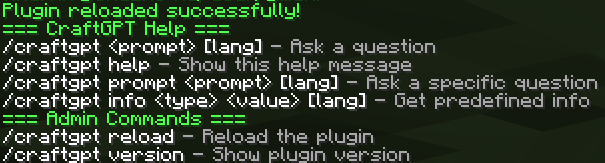

# CraftGPT

[RU](README_RU.md) | EN

CraftGPT is a powerful Minecraft plugin that integrates AI capabilities into your Spigot/Bukkit server, allowing players to interact with AI directly within the game.




## Features

-   AI integration within Minecraft
-   Command-based interaction (`/craftgpt`)
-   Support for multiple Minecraft versions (1.8.8+)
-   Configurable settings
-   Real-time AI responses
-   Free AI usage

## Requirements

-   Java 8 or higher
-   Spigot/Bukkit server (1.8.8 or higher)

## Installation

1. Download the latest `CraftGPT-1.0.0.jar` from the releases section
2. Place the JAR file in your server's `plugins` folder
3. Restart your server
4. A default configuration file will be generated at `plugins/CraftGPT/config.yml`

## Configuration

The plugin creates a `config.yml` file in the `plugins/CraftGPT` directory.

## Usage

Basic commands:

-   `/craftgpt <message>` - Send a message to the AI
-   `/craftgpt help` - Display help information
-   `/craftgpt reload` - Reload the plugin configuration
-   And more...

## Building from Source

This project uses Gradle as its build system. To build the plugin:

1. Clone the repository
2. Navigate to the project directory
3. Run:

```bash
./gradlew clean shadowJar
```

The compiled JAR will be in `build/libs/CraftGPT-1.0.0.jar`

## Dependencies

-   Spigot API
-   OkHttp3
-   JSON
-   Gson
-   SnakeYAML

## Contributing

Contributions are welcome! Feel free to:

-   Report bugs
-   Suggest enhancements
-   Submit pull requests

## License

This project is open source and available under MIT.

## Authors

-   art3m4ik3

## Support

If you find this plugin useful, please consider giving it a star on GitHub!

---

Made with ❤️ for the Minecraft community
